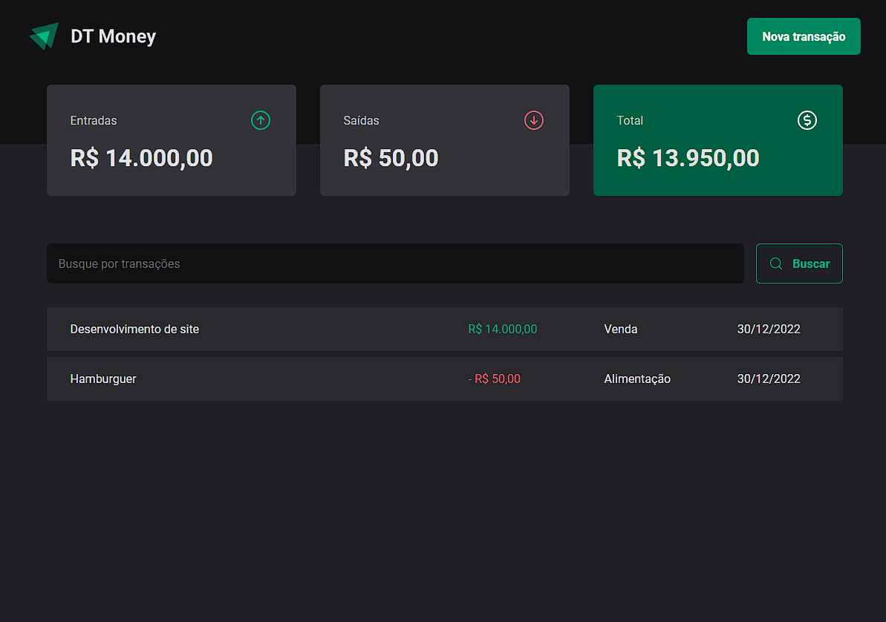

</div>

## ▶ Preview

[](https://dt-money-ruby-six.vercel.app/)

## 📃 About

DT Money, trata-se de um projeto que tem como objetivo o gerenciamento de finanças do usuário, tendo o controle do capital de entrada e saida.

## 🎨 Layout

- [Layout Figma - Original](https://www.figma.com/community/file/1138814493269096792)

## 🛠 Build with

- [HTML]()
- [CSS]()
- [TypeScript]()

## 🎞 Demo



## ⚙ Features

## 💻 Getting started

```sh
git clone https://github.com/GuiOrlandin/dt-money.git && cd
dt-money
```

Download [live server](https://marketplace.visualstudio.com/items?itemName=ritwickdey.LiveServer) extension on vscode and run.
